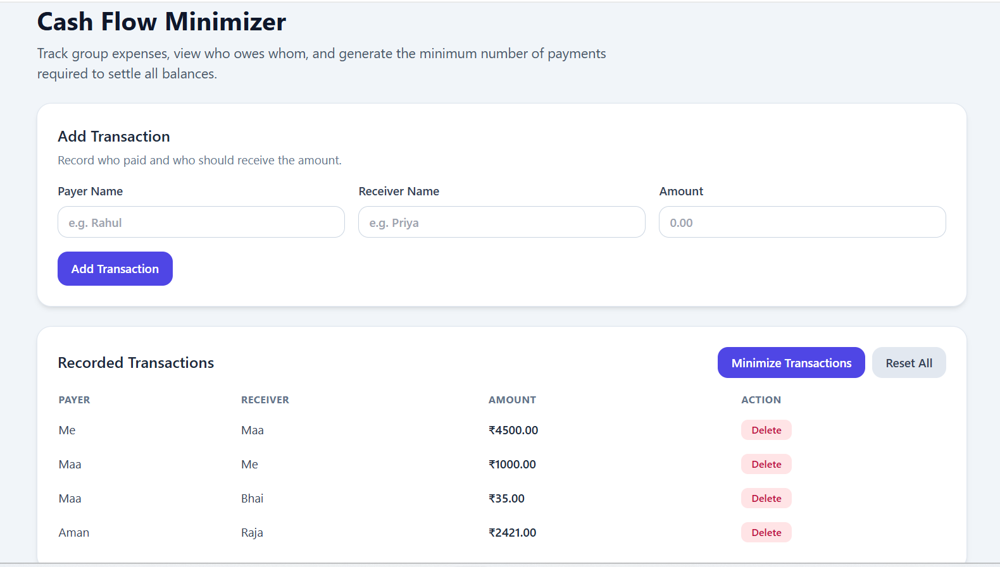

# Cash Flow Minimizer

A React-based web application that minimizes group transactions using a Greedy Algorithm and heap-based optimization.

## 🚀 Features

* Add transactions between friends
* View net balances (who owes / who gets)
* Optimize transactions to minimize total payments
* Displays reduction in number of transactions

## 🛠 Tech Stack

* React.js
* JavaScript
* Tailwind CSS

## ⚙️ Algorithm

* Uses Hash Map to compute net balances
* Applies Greedy Algorithm with Min Heap & Max Heap
* Time Complexity: O(N log N)

## ▶️ Run Locally

```bash
npm install
npm run dev
```

## 📸 Screenshots

## Screenshots

### Input


### Optimized Result


## 📌 Example

Input:
A → B: 100
B → C: 100

Output:
A → C: 100

Reduced transactions from 2 → 1
